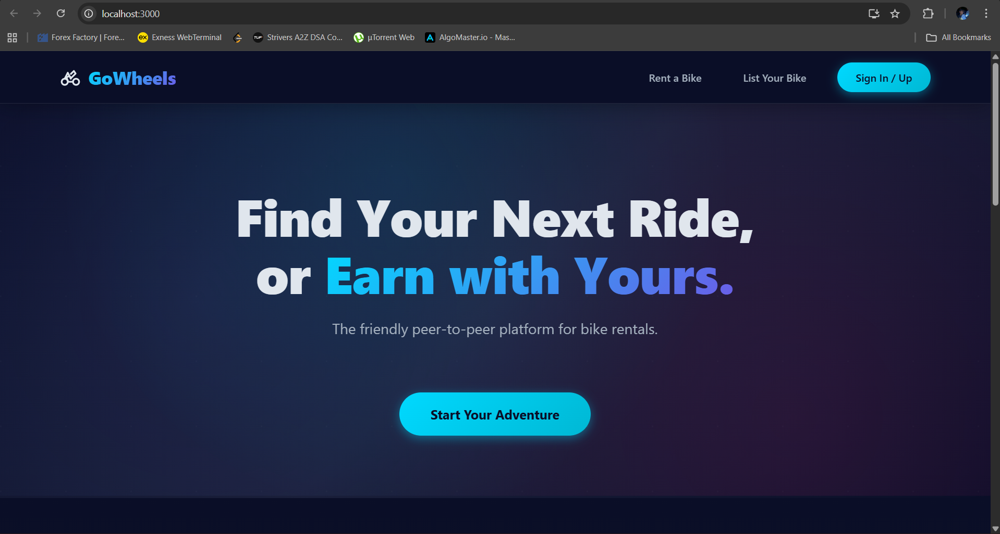
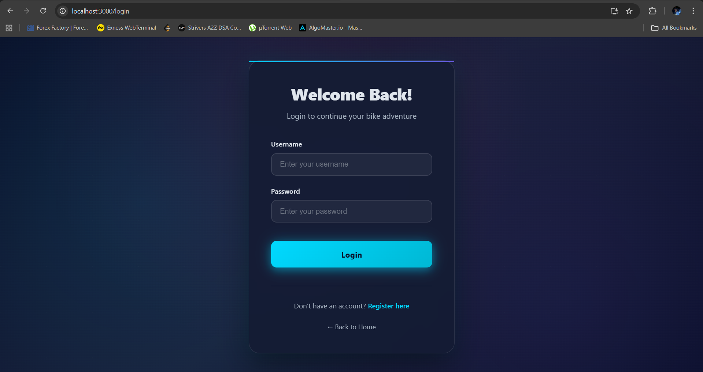

# GoWheels

A peer-to-peer bike rental platform that connects bike owners with renters.

## Screenshots

### Home Page
[](screenshots/home.png)

### Login
[](screenshots/login.png)

### Sign Up
[](screenshots/register.png)

### Browse Bikes
[](screenshots/vehicles.png)
### About GoWheels
[](screenshots/scroll.png)

## Project Structure

This project is organized as a monorepo containing both the frontend and backend:

- `gowheels-frontend/`: React application (created with Create React App)
- `gowheels-backend/`: Django REST Framework API

## Getting Started

### Prerequisites

- Node.js (v14 or higher)
- Python (v3.8 or higher)
- Git

### Backend Setup (Django)

```bash
# Navigate to backend folder
cd gowheels-backend

# Create Virtual Environment
# Windows:
python -m venv venv
# Mac/Linux:
python3 -m venv venv

# Activate Virtual Environment
# Windows:
venv\Scripts\activate
# Mac/Linux:
source venv/bin/activate

# Install Dependencies
pip install django djangorestframework django-cors-headers

# Run Migrations and Start Server
python manage.py migrate
python manage.py runserver
```

The API will be running at `http://127.0.0.1:8000/`

### Frontend Setup (React)

Open a new terminal (keep the backend running) and navigate to the frontend folder.

```bash
# Navigate to frontend folder
cd gowheels-frontend

# Install Dependencies
npm install

# Start the React Dev Server
npm start
```

The app will open at `http://localhost:3000/`

## Tech Stack

**Frontend:**
- React.js
- CSS3 (Custom Styling)
- SVG Icons

**Backend:**
- Django
- Django REST Framework
- SQLite (Default Database)